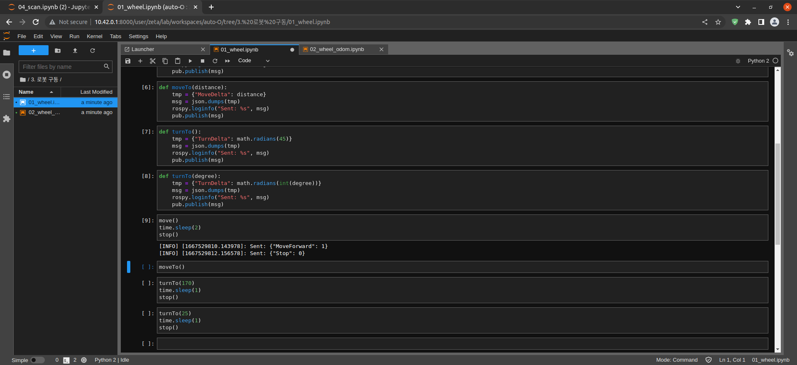

=================
Driving the Robot
=================

-   01_wheel.ipynb
-   | Running the cell code
    | `Ctrl + Enter`

.. image:: ../images/robot_drive2.png

.. code-block:: python

    import rospy
    import json
    from std_msgs.msg import String
    import time
    import math

-   Import python modules

.. code-block:: python

    pub = rospy.Publisher('/robot_command', String, queue_size=1)
    rospy.init_node('zetabot', anonymous=True)
    time.sleep(1)

-   Create zetabot Node
-   Create robot_command Topic Publisher

.. code-block:: python

    def move():
        tmp = {"MoveForward": 1}
        msg = json.dumps(tmp)
        rospy.loginfo("Sent: %s", msg)
        pub.publish(msg)

-   Create a move() function
-   Convert {"MoveForward": 1} to Json String
-   Publish the converted message

.. code-block:: python

    def stop():
        tmp = {"Stop": 0}
        msg = json.dumps(tmp)
        rospy.loginfo("Sent: %s", msg)
        pub.publish(msg)

-   Create stop() function
-   Convert {"Stop": 0} to Json String
-   Publish the converted message

.. code-block:: python 

    def moveTo():
        tmp = {"MoveDelta": -0.5}
        msg = json.dumps(tmp)
        rospy.loginfo("Sent: %s", msg)
        pub.publish(msg)

-   Create a moveTo() function
-   Convert {"MoveDelta": -0.5} to Json String
-   Publish the converted message

.. code-block:: python 

    def moveTo(distance):
        tmp = {"MoveDelta": distance}
        msg = json.dumps(tmp)
        rospy.loginfo("Sent: %s", msg)
        pub.publish(msg)

-   Create a moveTo(distance) function
-   Convert {"MoveForward": distance} to Json string
-   Publish the converted message

.. code-block:: python

    def turnTo():
        tmp = {"TurnDelta": math.radians(45)}
        msg = json.dumps(tmp)
        rospy.loginfo("Sent: %s", msg)
        pub.publish(msg)

-   Create turnTo() function
-   Convert 45° to radians
-   Convert {"TurnDelta": math.radians(45)} to Json string
-   Publish the converted message

.. code-block:: python

    def turnTo(degree):
        tmp = {"TurnDelta": math.radians(int(degree))}
        msg = json.dumps(tmp)
        rospy.loginfo("Sent: %s", msg)
        pub.publish(msg)

-   Create turnTo(degree) function
-   Convert degree(°) to radians
-   Convert radian to int
-   Convert {"TurnDelta": math.radians(int(degree))} to Json string
-   Publish the converted message

.. code-block:: python

    move()
    time.sleep(2)
    stop()

-   Run the move() function
-   2 second time delay
-   Run the stop() function

.. code-block:: python

    moveTo(1)

-   Execute the moveTo(distance) function
-   1 distance forward

.. code-block:: python

    turnTo(170)
    time.sleep(1)
    stop()

-   Run the turnTo(degree) function
-   170 degree rotation
-   1 second time delay
-   Run the stop() function

.. code-block:: python

    turnTo(25)
    time.sleep(1)
    stop()

-   Run the turnTo(degree) function
-   25 degree rotation
-   1 second time delay
-   Run the stop() function