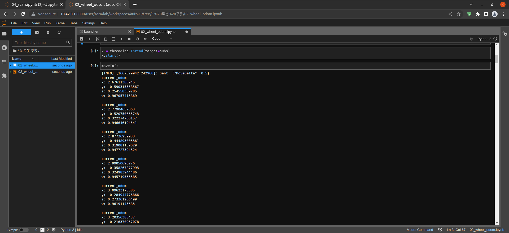

============================
Driving the Robot (Odometry)
============================

-   02_wheel_odom.ipynb
-   | Running the cell code
    | `Ctrl + Enter`

.. code-block:: python

    import rospy
    import json
    from std_msgs.msg import UInt8MultiArray, String
    from nav_msgs.msg import Odometry
    import time
    import math
    import threading

-   Import python modules

.. code-block:: python

    rospy.init_node('zetabot')
    move_pub = rospy.Publisher('/robot_command', String, queue_size=1)

-   Create zetabot Node
-   Create robot_command Topic Publisher

.. code-block:: python

    is_robot_move = False

-   Set the is_robot_move variable to False

.. code-block:: python

    def moveTo():
        tmp = {"MoveDelta": 0.5}
        msg = json.dumps(tmp)
        rospy.loginfo("Sent: %s", msg)
        move_pub.publish(msg)

-   Create a moveTo() function
-   Convert {"MoveDelta": -0.5} to Json String
-   Publish the converted message

.. code-block:: python 

    def process_odom(data):
        if is_robot_move == True:
            x = data.pose.pose.position.x
            y = data.pose.pose.positioan.y
            z = data.pose.pose.orientation.z
            w = data.pose.pose.orientation.w
            print("current_odom\nx: {}\ny: {}\nz: {}\nw: {}\n".format(x,y,z,w))
            rospy.sleep(0.5)

-   Create process_odom(data) function
-   If is_robot_move variable is True, output x, y, z, w values of odom Topic

.. code-block:: python 

    def process_serial_input(data):
        global is_robot_move
        if len(data.data) != 0:
            is_robot_move = True
            rospy.sleep(0.1)
            is_robot_move = False

-   Create process_serial_input(data) function
-   If the length of motor_driver_serial_input Topic is not 0, set is_robot_move variable to True
-   Set the is_robot_move variable to False after a 0.1 second time delay

.. code-block:: python

    def subs():
        rospy.Subscriber("motor_driver_serial_input", UInt8MultiArray, process_serial_input, queue_size=1)
        rospy.Subscriber("odom", Odometry, process_odom, queue_size=1)
        rospy.spin()

-   Create subs function
-   Create motor_driver_serial_input Topic Subscriber
-   Create an odom Topic Subscriber

.. code-block:: python

    x = threading.Thread(target=subs)
    x.start()
    
-   Assign the subs() function to Thread
-   Thread execution

.. code-block:: python

    moveTo()

-   Run the moveTo() function
