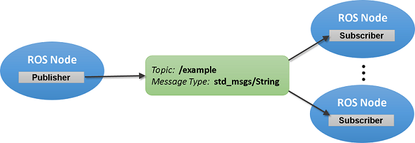

ROS
===

* ROS Features
  1. Robot Operation System
  2. Middleware that mediates the operating system and robot hardware
  3. It is easy to reuse programs by exchanging messages between nodes
  4. Various libraries and GUI-based interface support
  5. Open source, a wide community of developers
    * EN: ROS Discourse (`ROC_en`_)
    * KR : 오로카 (`ROC_kr`_)

.. _ROC_en: https://discourse.ros.org/
.. _ROC_kr: https://cafe.naver.com/openrt
    
